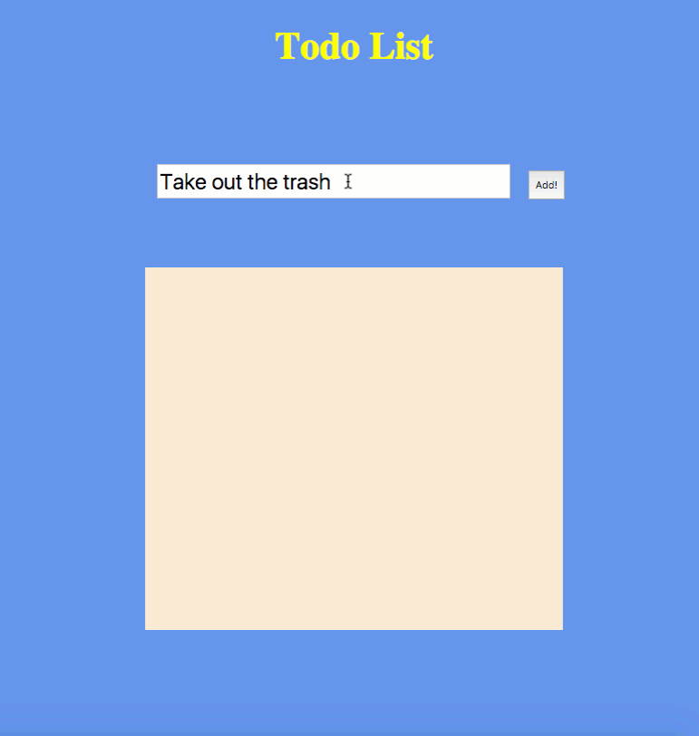

# List App with jQuery

## Instructions
Use the provided starter HTML to make a list app. This app will take text from an input box and display it in another box elsewhere on the page. Add a way to click and delete the entries you add, too.

* Bonus:
  * Add a new entry when you press the `return` key;
  * Style it.
## Info
An example of the functionality:

## Copyright
Coding Boot Camp (C) 2016. All Rights Reserved.