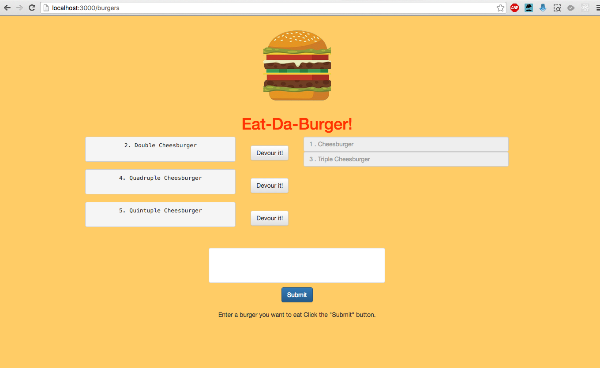
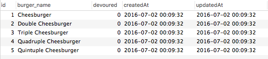
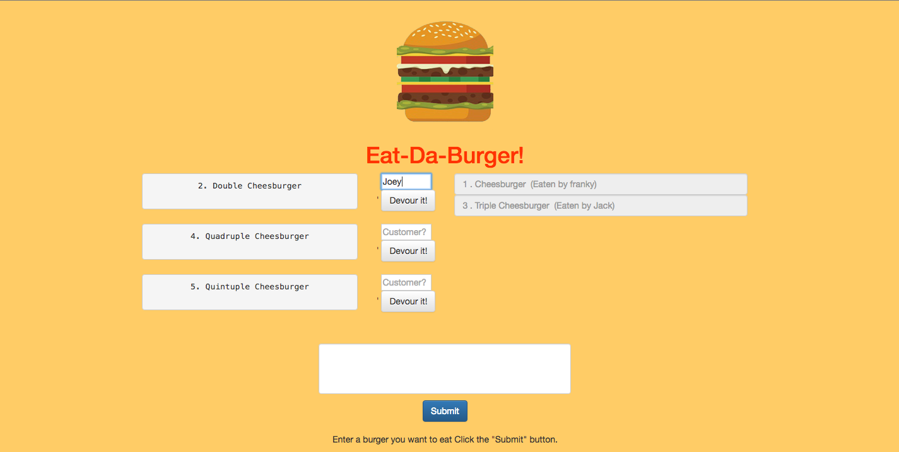

# Week 15 Assignment - Burger 2: The Sequel!

### Overview
In this assignment, you're going to Sequelize the `Burger` app you made last week. We've split this exercise into three different tiers, all with different tasks and expectations. Finish whichever tier will provide you with the most reasonable challenge.

### Remember

* You will be fully capable of doing this homework by the end of Saturday's class.

### Before you Begin
1. Create a new folder called `sequelizedBurger`
2. Copy the contents of your completed assignment from last week.
	* Remove the older git connection with `rm -R .git`. 
	* Then connect this folder with a new github repo.
3. Run `sequelize init` to create the neccesary sequel files.

* **Note**: If for any reason you don't have a finished assignment for last week, no problem. Message the instructor, who will provide you will a skeleton file to work of for this week.

## Instructions 
Put in your best efforts to complete one of these three challenge tiers:

#### Tier 1: Sequelized! (Basic to Moderate)

* Remove all references to your vanilla MySQL queries and replace them with Sequelize queries.

* That means:
	* Replacing your MySQL `Burger` model with a Sequelized equivalent.
		* Don't forget to edit the model and initial migration file to make the burger's devoured field carry a default value of false -- otherwise you might encounter bugs.
			* There's no option to include that default in the command line, so you'll need to open up Sublime to make this change. 
		* Don't forget to sync the models!

	* Edit your new `config.json` file to include your database configurations. Place your JawsDB details in the `production` property of your json file; the details of your local database go in the `developer` property.

	* Remove your old ORM file, as well as any references to it in `burgers_controller.js`. Replace those references with Sequelize's ORM methods.

* When you finish, your site should function just like your last one:
	
	

#### Tier 2: Migrated! (Moderate to Challenge)

* Now that your burger app's ready, enter in some dummy data to test it out.

* Using the `Sequelize CLI`, create a migration file that bulk inserts at least five burgers into your database. 

	

* Don't forget to define both the `up` and `down` methods in your migration file. If you create data when running `sequelize db:migrate`, you need to be able to remove that data with `sequelize db:migrate:undo`.

* **HERE'S THE REAL CHALLENGE**: In your `down` method, how can you make sure that the ids of your burgers go back to the smallest available integer.
	* For example, say you have burgers in your database with ids 1, 2, 3, 4 and 5. Running `sequelize db:migrate:undo` will remove those burgers. But then `sequelize db:migrate` places them back into the database with ids 6, 7, 8, 9 and 10 -- even though there are no burgers with ids less than 6. How can you stop this id gap from occurring?

#### Tier 3: Associated! (Challenge)

* Add in an association of your choice to the project. This will involve creating at least one new model and connecting it with your Burger model.

* Get creative! This solution is up to you.

* For example, you could make a site that logs the names of the customers who eat your burgers. If you can't think of another type of association, try this one!

	

* If you do go select this tier, you must edit the handlebars files and CSS stylesheets to implement some sort of additional feature to the site. We don't want you to just connect two models and submit your project. Make your site do something relevant to this association.

-------
### One More Thing
If you have any questions about this project or about the material we covered, the instructor and your TAs are only a Slack message away.

**Good Luck!**

## Copyright
Coding Boot Camp (C) 2016. All Rights Reserved.